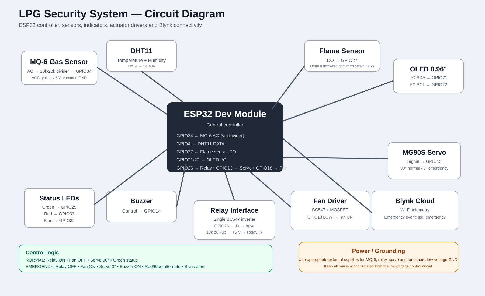
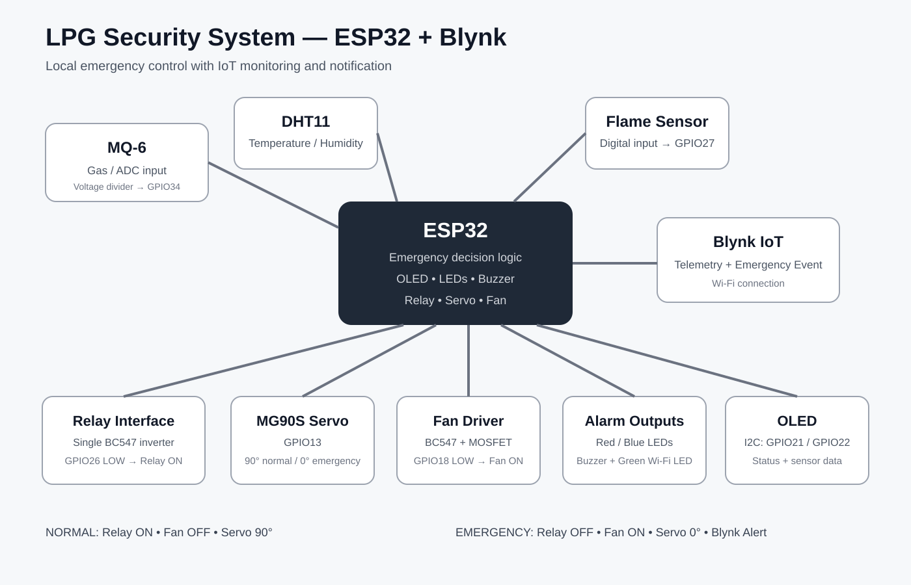

# LPG Security System

  
  
  
  

> **ESP32 • MQ-6 • DHT11 • Flame Sensor • Blynk • OLED • Relay • Servo • Fan • Alarm LEDs**

An ESP32-based LPG and fire-safety prototype that monitors gas, flame, and temperature conditions locally and reports system status to Blynk over Wi-Fi.

The system is designed around a simple rule:

**If gas, flame, or high temperature is detected, enter emergency mode.**

## Features

- MQ-6 gas sensing with filtered ADC monitoring
- DHT11 temperature and humidity monitoring
- Flame sensor detection
- Local emergency decision-making on the ESP32
- 0.96-inch I2C OLED status display
- Green Wi-Fi status LED
- Red/blue alternating emergency LEDs
- Buzzer emergency alarm
- Servo-controlled prototype regulator mechanism
- Relay-controlled prototype load
- Fan controlled through the BC547 + MOSFET driver
- Blynk live telemetry
- Blynk push notification for emergency activation
- Continues local safety behavior when Wi-Fi/Blynk is unavailable

## System behavior

### Normal mode

| Output | State |
|---|---|
| Relay | ON |
| Fan | OFF |
| Servo | 90° |
| Buzzer | OFF |
| Red LED | OFF |
| Blue LED | OFF |
| Green LED | Solid ON when Wi-Fi is connected |
| Green LED | Blinking while connecting/disconnected |

### Emergency mode

Emergency mode is activated when **any one** of the following is true:

- MQ-6 filtered ADC value >= GAS_THRESHOLD
- Flame detected
- Temperature >= TEMPERATURE_THRESHOLD

| Output | Emergency state |
|---|---|
| Relay | OFF |
| Fan | ON |
| Servo | 0° |
| Buzzer | ON |
| Green LED | OFF |
| Red/Blue LEDs | Alternating flash |

The ESP32 performs the emergency response locally; Blynk is used for telemetry and remote notification rather than as the safety decision-maker.

## Hardware

- ESP32 development board
- MQ-6 gas sensor module
- DHT11 temperature/humidity sensor
- Flame sensor module
- TowerPro MG90S mini digital servo
- 0.96-inch I2C OLED
- 5 V relay module
- BC547 transistor(s)
- MOSFET for fan switching
- Red, blue, and green LEDs
- Buzzer
- DC fan
- Suitable regulated power supplies
- Resistors and wiring

## ESP32 pin map

| Function | GPIO |
|---|---:|
| MQ-6 analog input | 34 |
| DHT11 DATA | 4 |
| Flame sensor DO | 27 |
| OLED SDA | 21 |
| OLED SCL | 22 |
| Relay interface | 26 |
| MG90S servo signal | 13 |
| Green LED | 25 |
| Red LED | 33 |
| Blue LED | 32 |
| Buzzer | 14 |
| Fan driver | 18 |

## Relay interface — single BC547

The relay module used in the prototype is powered from 5 V. A single BC547 is used as an inverting interface:

~~~text
ESP32 GPIO26 ---- 1 kΩ ----> BC547 Base
BC547 Base ----- 4.7 kΩ ---- GND
BC547 Emitter ---------------- GND
BC547 Collector ------------- Relay IN
BC547 Collector -- 10 kΩ ---- +5 V

Relay VCC -------------------- +5 V
Relay GND -------------------- GND
ESP32 GND -------------------- common GND
~~~

Logic:

~~~text
GPIO26 LOW  -> BC547 OFF -> Relay IN pulled HIGH (~5 V) -> Relay ON
GPIO26 HIGH -> BC547 ON  -> Relay IN pulled LOW        -> Relay OFF
~~~

The actual active-high/active-low behavior should be verified on the specific relay board before connecting a mains load.

## MQ-6 ADC protection

When an MQ-6 module is powered from 5 V, its analog output should not be connected directly to an ESP32 ADC pin.

Recommended divider:

~~~text
MQ-6 AO ---- 10 kΩ ----+---- GPIO34
                       |
                      20 kΩ
                       |
                      GND
~~~

This scales a 5 V signal to approximately 3.33 V.

**Important:** the MQ-6 value in this project is an ADC/relative sensor reading, not a certified LPG concentration in ppm.

## Fan driver

The fan is switched separately using the previously designed BC547 + MOSFET low-side stage.

Firmware assumption:

~~~text
GPIO18 LOW  -> Fan ON
GPIO18 HIGH -> Fan OFF
~~~

Use a fan supply rated for the actual load current and appropriate flyback/decoupling protection for the fan type.

## OLED

Typical 0.96-inch I2C OLED connection:

~~~text
OLED VCC -> 3.3 V
OLED GND -> GND
OLED SDA -> GPIO21
OLED SCL -> GPIO22
~~~

The firmware expects I2C address 0x3C.

## Blynk

### Datastreams

| Virtual Pin | Name | Type |
|---|---|---|
| V0 | Gas Raw | Integer |
| V1 | Gas Level / Filtered ADC | Integer |
| V2 | Temperature | Double |
| V3 | Humidity | Double |
| V4 | Flame | Integer (0/1) |
| V5 | Emergency | Integer (0/1) |
| V6 | Relay | Integer (0/1) |
| V7 | Fan | Integer (0/1) |
| V8 | Servo Angle | Integer (0–180) |
| V9 | Wi-Fi | Integer (0/1) |
| V10 | Alarm Cause | String |
| V11 | Blynk Connected | Integer (0/1) |

### Emergency notification

Create this custom Blynk Event:

- **Event name:** LPG Emergency
- **Event code:** lpg_emergency
- **Type:** Critical
- **Push notification:** Enabled

The firmware sends the event with:

~~~cpp
Blynk.logEvent("lpg_emergency", message);
~~~

The event is generated on a transition from normal to emergency. If Blynk is unavailable at that moment, the firmware keeps the event pending and sends it when Blynk reconnects.

See [docs/BLYNK_SETUP.md](docs/BLYNK_SETUP.md) for the dashboard/datastream setup.

## Software setup

### Libraries

Install these Arduino libraries:

- Blynk
- DHT sensor library
- Adafruit GFX Library
- Adafruit SSD1306
- ESP32Servo

### Configuration

Copy:

~~~text
config.h.example -> config.h
~~~

Then replace the placeholders with your own Wi-Fi and Blynk credentials.

`config.h` is ignored by Git so credentials are not published.

### Upload

1. Open LPG-Security-System.ino in Arduino IDE.
2. Select the correct ESP32 board.
3. Select the correct COM port.
4. Compile.
5. Upload.
6. Open Serial Monitor at **115200 baud**.

## Project Media

Real hardware photographs, Serial Monitor output, Blynk dashboard, and Datastream screenshots will be added as the prototype documentation is completed.

## Testing sequence

Test progressively rather than connecting everything at once:

1. Verify ESP32 boot and serial output.
2. Verify green LED blinking while Wi-Fi is connecting.
3. Verify green LED becomes solid after Wi-Fi connection.
4. Test the relay interface with a multimeter and without mains connected.
5. Test the servo movement.
6. Test the fan driver with the correct fan power supply.
7. Verify flame sensor polarity.
8. Observe MQ-6 readings and tune GAS_THRESHOLD.
9. Configure Blynk datastreams and event.
10. Trigger controlled emergency conditions and verify the complete response.

## Circuit diagram

### Detailed circuit diagram

### System architecture

## Safety and limitations

This project is a **prototype/academic embedded-systems project**, not a certified LPG leak detector, fire alarm, or safety controller.

- Do not treat raw MQ-6 ADC readings as calibrated ppm values.
- Do not deliberately release LPG near electronics, switches, motors, or flame sources.
- Keep mains wiring isolated, enclosed, fused/protected, and off breadboards.
- The local ESP32 logic is intentionally independent of Blynk/Wi-Fi.
- For real-world deployment, use certified gas/fire detection equipment and appropriate safety engineering.

## Repository structure

~~~text
LPG-Security-System/
├── LPG-Security-System.ino
├── README.md
├── LICENSE
├── config.h.example
├── .gitignore
└── docs/
    ├── BLYNK_SETUP.md
    └── LPG_FINAL_SYSTEM.svg
~~~

## License

MIT License. See [LICENSE](LICENSE).
